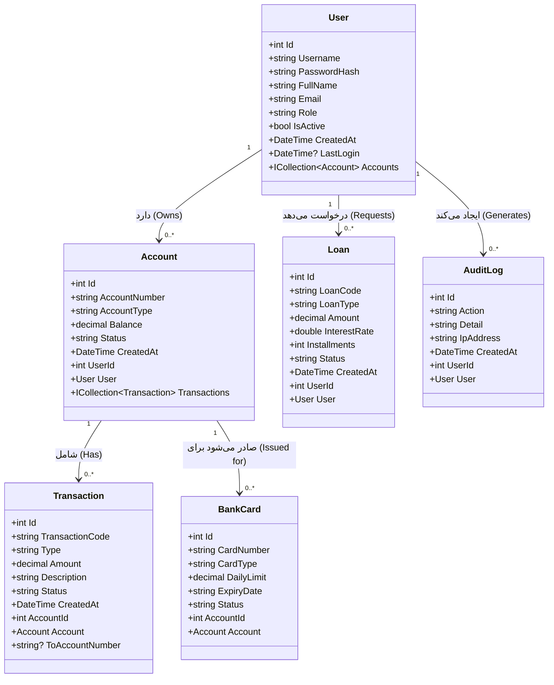
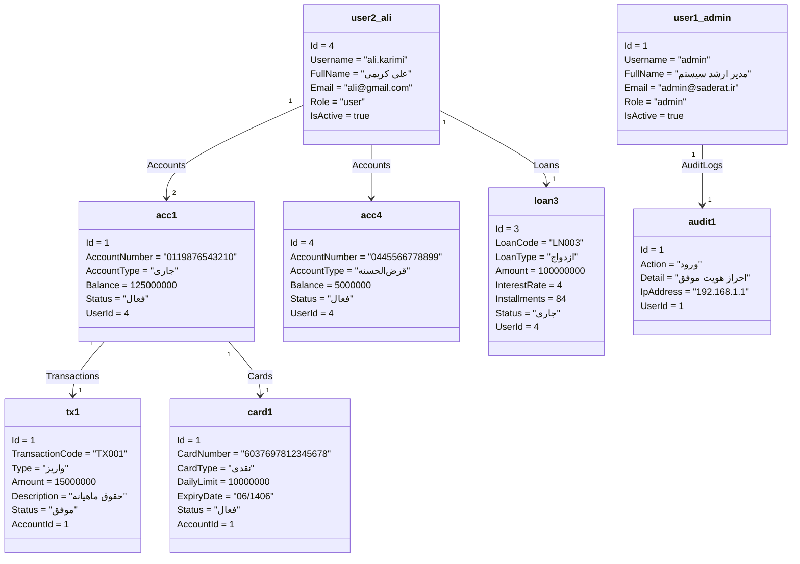
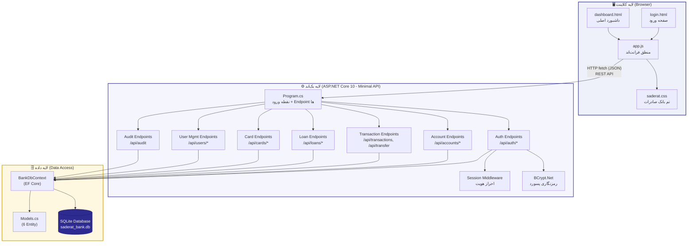
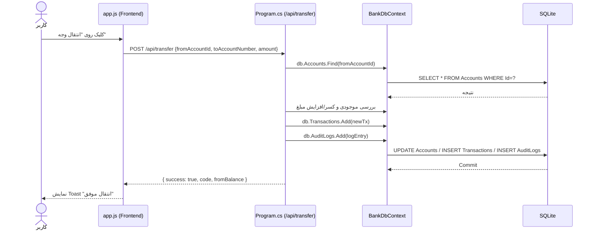

# 📐 نمودارهای UML — سامانه بانک صادرات ایران

این فایل سه نمودار اصلی UML پروژه را شامل می‌شود:

1. **نمودار کلاس (Class Diagram)** — ساختار مدل‌های داده و روابط بین آن‌ها
2. **نمودار شیء (Object Diagram)** — نمونه‌ای از داده‌های واقعی در زمان اجرا
3. **نمودار مؤلفه (Component Diagram)** — اجزای معماری سیستم و ارتباط آن‌ها

> برای مشاهده نمودارها به صورت گرافیکی، این فایل را در **GitHub**, **GitLab**, یا یک ویرایشگر Markdown با پشتیبانی از Mermaid (مثل VS Code + پلاگین Mermaid، یا [mermaid.live](https://mermaid.live)) باز کنید.

---

## 1️⃣ نمودار کلاس (Class Diagram)

این نمودار ۶ موجودیت (Entity) اصلی پروژه را که در `Models/Models.cs` تعریف شده‌اند، به همراه روابط (Relationships) و Multiplicity آن‌ها نشان می‌دهد.

### توضیح روابط

| رابطه | نوع | توضیح |
|-------|-----|-------|
| `User → Account` | One-to-Many | هر کاربر می‌تواند چند حساب داشته باشد |
| `User → Loan` | One-to-Many | هر کاربر می‌تواند چند درخواست وام داشته باشد |
| `User → AuditLog` | One-to-Many | هر کاربر چندین رویداد حسابرسی ایجاد می‌کند |
| `Account → Transaction` | One-to-Many | هر حساب چندین تراکنش دارد |
| `Account → BankCard` | One-to-Many | برای هر حساب می‌توان چند کارت صادر کرد |

---

## 2️⃣ نمودار شیء (Object Diagram)

این نمودار یک نمونه واقعی (Instance) از داده‌ها را در یک لحظه از اجرای برنامه نشان می‌دهد — بر اساس داده‌های Seed موجود در `BankDbContext.cs`.

### توضیح نمونه

این نمودار نشان می‌دهد کاربر **علی کریمی** (`ali.karimi`، Id=4، نقش `user`) دارای دو حساب است:
- حساب جاری `0119876543210` با موجودی ۱۲۵,۰۰۰,۰۰۰ تومان که یک تراکنش واریز (`TX001`) و یک کارت نقدی روی آن صادر شده.
- حساب قرض‌الحسنه `0445566778899` با موجودی ۵,۰۰۰,۰۰۰ تومان.

همچنین یک وام ازدواج (`LN003`) با وضعیت «جاری» به نام او ثبت شده، و کاربر **ادمین** یک رویداد ورود (`audit1`) در سیستم ثبت کرده است.

---

## 3️⃣ نمودار مؤلفه (Component Diagram)

این نمودار معماری کلی سیستم را در سه لایه نشان می‌دهد: **فرانت‌اند**، **بک‌اند (ASP.NET Core 10)** و **پایگاه داده (SQLite)**.

### توضیح مؤلفه‌ها

| لایه | مؤلفه | نقش |
|------|-------|------|
| **کلاینت** | `login.html` / `dashboard.html` | رابط کاربری (UI) |
| **کلاینت** | `app.js` | منطق سمت کلاینت، فراخوانی API، مدیریت نقش‌ها |
| **کلاینت** | `saderat.css` | تم رنگی بانک صادرات (آبی‌بنفش/سفید) |
| **بک‌اند** | `Program.cs` | تعریف تمام Endpoint های REST API (Minimal API) |
| **بک‌اند** | Session Middleware | نگهداری وضعیت ورود کاربر |
| **بک‌اند** | BCrypt.Net | هش کردن و تطبیق رمز عبور |
| **داده** | `BankDbContext` | پل ارتباطی EF Core با SQLite |
| **داده** | `Models.cs` | تعریف ۶ Entity (User, Account, Transaction, Loan, BankCard, AuditLog) |
| **داده** | `saderat_bank.db` | فایل فیزیکی پایگاه داده SQLite |

### جریان یک درخواست نمونه (مثال: انتقال وجه)

---

## 📦 جمع‌بندی

| نمودار | فایل مرتبط | هدف |
|--------|-----------|------|
| Class Diagram | `Models/Models.cs`, `Data/BankDbContext.cs` | نشان دادن ساختار داده و روابط Entity ها |
| Object Diagram | `Data/BankDbContext.cs` (Seed Data) | نمونه واقعی داده در زمان اجرا |
| Component Diagram | کل پروژه (`Program.cs`, `wwwroot/*`) | معماری کلی و ارتباط لایه‌ها |
| Sequence Diagram | `Program.cs` (`/api/transfer`) | جریان یک عملیات از کلاینت تا دیتابیس |
